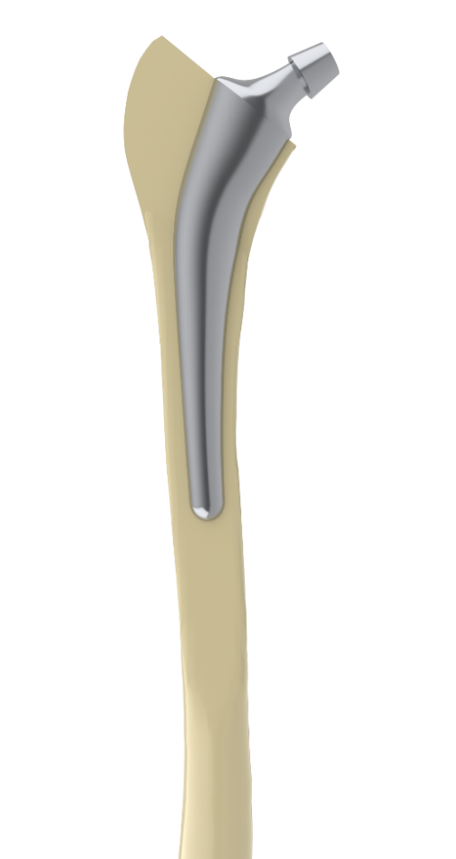

# CAEE for automated individualization of hip endoprostheses - open repository
This repository serves as a central hub for information related to the Computer-Aided Engineering Environment (CAEE) for automated individualization of hip endoprostheses. The specific data, scripts and materials associated with the project are archived in a separate, non-public repository. Access to this private archive may be granted upon individual request. Interested persons are invited to submit a formal request for access, either by direct communication through GitHub or by sending an email to mueller@ipeg.uni-hannover.de.

For more detailed information and to gain a deeper understanding of the CAEE's methodologies and applications, consult the related publications and the doctoral thesis provided with this project.





## How to cite
```BibTeX
@misc{MuellerCAEE,
  author = {Müller, Patrik},
  title = {CAEE for automated individualization of hip endoprostheses},
  year = {2024},
  publisher = {GitHub},
  howpublished = {\url{https://github.com/MuellerIPeG/CAEE-Automated_Individualization_of_Implantats}},
}
```

<!--- [](https://doi.org/10.1038/s41597-023-02669-z) (2023). --->

## Usage

Follow these steps to set up and use the CAEE (Computer-Aided Engineering Environment):

### 1. Store CAEE Locally

First, save the CAEE files on your local machine. Ensure you have a specific folder for these files to maintain an organized workspace.

### 2. Install Rhino Compute

Install Rhino Compute by downloading it from the official website and following the provided installation instructions. Rhino Compute is essential for running computations in a Rhino environment externally.

### 3. Run PIP Installers

After setting up Rhino Compute, execute the necessary PIP installers to install additional Python libraries and dependencies needed by the CAEE. In your command line interface (CLI), run the pip install commands listed in the project documentation.

### 4. Verify Rhino Compute Activation

To confirm that Rhino Compute is operational, visit `http://localhost:8081/version` in your web browser. A properly running Rhino Compute will display version information on this page.

### 5. Launch the Main / GUI Application

To start the CAEE, run `main.py` for the standard operation mode. For a more user-friendly approach, launch the CAEE through the GUI by running `gui.py`:


## Individualization Process


## Related work and data
Contains the function `FemurSegmentation` from Biondi, Riccardo et al. (https://github.com/RiccardoBiondi/FemurSegmentation)

## Licenses

Biondi? CT-Scans? 

- [](https://creativecommons.org/licenses/by-nc-sa/4.0/) for MAT, DCM and XLSX files.
- [](https://eupl.eu/1.2/en/) for MATLAB, GRASSHOPPER and Python source code.

## Related publications
Müller, P.: Designing a methodological framework for the individualization of prosthetic implants: a literature-based approach. Poster from the Workshop Innovative Product Development by Additive Manufacturing, 20.-21. September 2023, Garbsen, Germany. [](<https://doi.org/10.15488/15710>)


